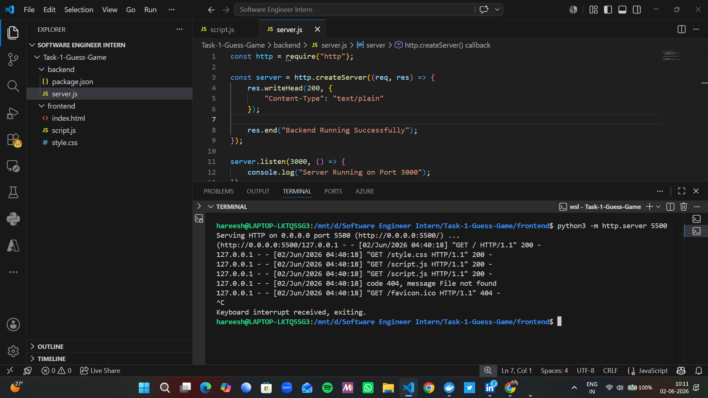
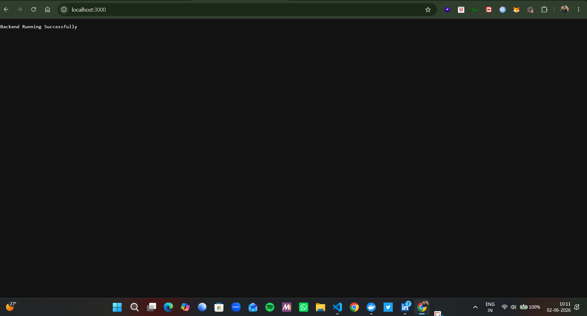
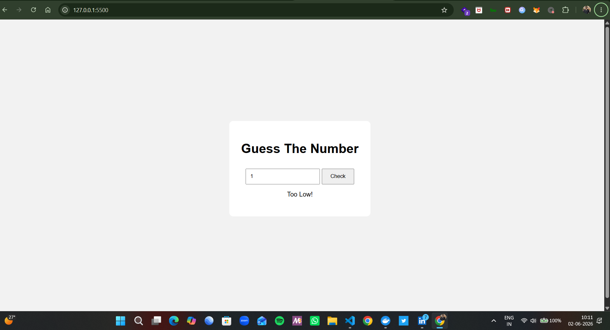

# 🎮 Guess The Number Game

A simple interactive number guessing game developed as part of the Cognifyz Technologies Software Development Internship.

---

## 📌 Objective

Develop a basic game using conditional statements and JavaScript logic where users attempt to guess a randomly generated number.

---

## 🚀 Features

- Random Number Generation
- User Input Validation
- Interactive Gameplay
- Conditional Logic (if-else)
- Frontend & Backend Implementation
- Beginner-Friendly Project

---

## 🛠️ Technologies Used

- HTML5
- CSS3
- JavaScript
- Node.js

---

## 📂 Project Structure

```text
Task-1-Guess-The-Number-Game
│
├── frontend
│   ├── index.html
│   ├── style.css
│   └── script.js
│
├── backend
│   ├── package.json
│   └── server.js
│
├── screenshots
│   ├── game-interface.png
│   ├── correct-guess.png
│   └── backend-running.png
│
└── README.md
```

---

## 📸 Screenshots

### 🎯 Game Interface



---

### ✅ Correct Guess Result



---

### ⚙️ Backend Running



---

## ▶️ How to Run

### Frontend

Open:

```text
frontend/index.html
```

in your browser.

---

### Backend

Navigate to backend folder:

```bash
cd backend
```

Run server:

```bash
node server.js
```

Output:

```text
Server Running on Port 3000
```

---

## 🎓 Learning Outcomes

- JavaScript Fundamentals
- Conditional Statements
- Event Handling
- DOM Manipulation
- Random Number Logic
- Basic Node.js Server

---

## 👨‍💻 Author

**Hareesh Rajput**

Software Engineer Intern

Cognifyz Technologies
